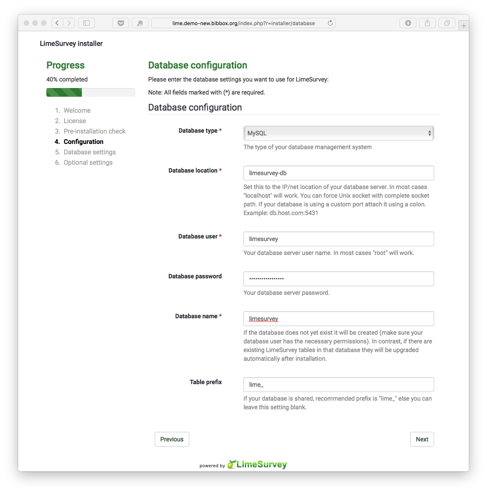

## LimeSurvey Installation Instructions 

## Install Parameters

* Database location = limesurvey-db
* Database user = limesurvey
* Database password = limesurvey4bibbox
* Database name = limesurvey

## Populate the Database

## Login

* user: admin
* password: password

Please change the password. 

## After the installation

Have a nice ride with the new Admins youngtimer.

