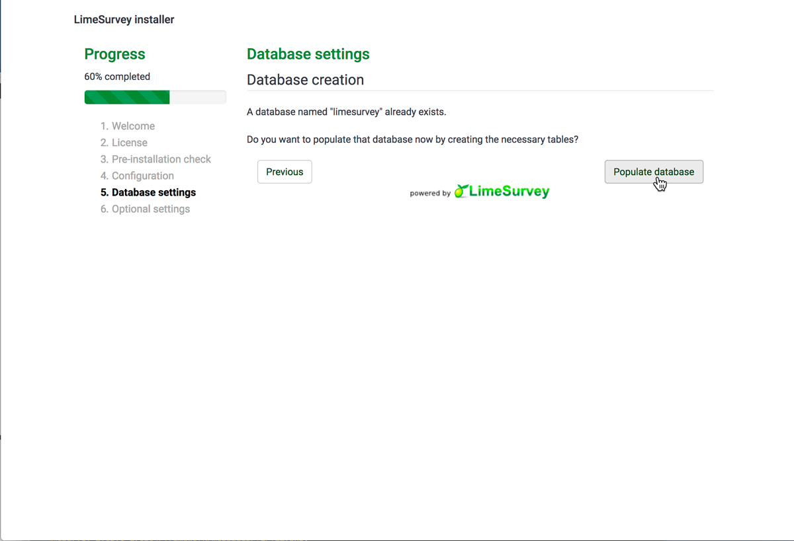

## Quick Notes

Administration panel can be reached by appending /admin after the URL.
E.g. ***http://limesurvey.demo.bibbox.org/admin***

Database information is as follows:

```
Database type:      MySQL
Database location:  limesurvey-db
Database user:      limesurvey
Database password:  limesurvey4bibbox
Database name:      limesurvey
Table prefix:       lime_
```


## LimeSurvey Installation Instructions 

* As soon as LimeSurvey has been installed within the BIBBOX, you can launch it from the Applications menu.

* A new Tab will open in your browser and show you the welcome page of the step-by-step installation. From the dropdown selection choose your prefered language for the installation steps (default English) and click on the **Start installation** button.


* You will be presented the licensing information for LimeSurvey which is under the GNU licensing model. If you are done reading them click on the **I accept** button.


* In step 3 of the installation, LimeSurvey will check if all dependencies are enabled correctly. This should give you lots of green check marks which means everything is set up correctly. Just go ahead and press the **Next** button.


* This next step will prompt you with an form for database configuration. This BIBBOX application already comes with an MySQL database up and running, so you simply need to enter the following values into the fields:

        Database type:      MySQL
        Database location:  limesurvey-db
        Database user:      limesurvey
        Database password:  limesurvey4bibbox
        Database name:      limesurvey
        Table prefix:       lime_
        
    Please note, that the table prefix can be anything you want, as long as it follows this pattern **string_**


* LimeSurvey should now be able to connect to your database and find out, that it already exists. In fact, this database doesn't have any tables yet, but LimeSurvey offers us the option to automatically populate the database for us. So go ahead and click **Populate database**.



* You should now get a message that the database has successfully been populated and see yet another form. This time, LimeSurvey needs information about its administration account. This is where you should set your **Admin login name**, **Admin login password** and **Admin login password confirmation**, as well as the admins **Administrator name** and **Admininistrator email**. You can also set the **Site name** and change LimeSurveys **Default language**. When all is set correctly click the **Next** button.


* This is the last step of the installation process. All it does is informing you, that the installation was successful and which username and password you chose for the administration account (default username is **admin** and password is **password**). If you see this screen you can finish the installation by clicking the **Administration** button.


* Very nice, you have reached the administration login page! Please note, that this is not the default page of LimeSurvey when you start the application the next time. Instead you will see an overview of your active surveys. You can reach the administration again by appending **/admin** after your LimeSurvey URL, e.g. ***http://limesurvey.demo.bibbox.org/admin***. For now, let's just enter our admin's username and password and click the **Log in** button.


* That's it! You have successfully installed LimeSurvey in your BIBBOX and are ready for creating and managing your surveys with it!


## After the installation

Have a nice ride with the new Admins youngtimer.


